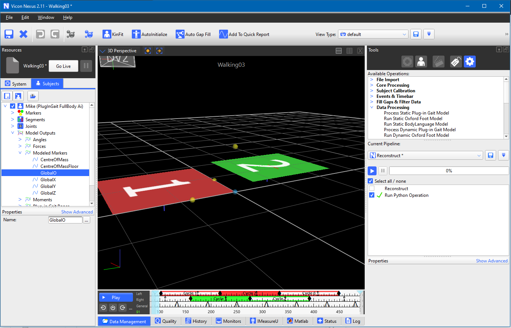

# About

This Python Code is an example code created to work in conjunction with Vicon Nexus 2 and Python 2.
(you can also run the code using the Vicon Nexus Python Integration)

## Requirements
### Versions:
Vicon Nexus 2

Python 2.7 (gets installed with Nexus 2)
